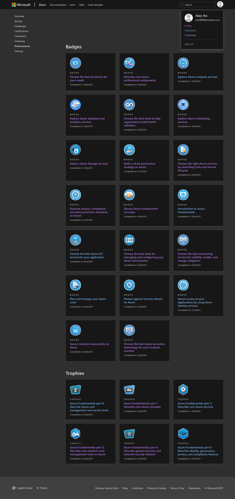

# 266995_CloudComputingBadges
## Badges and Trophies
Cloud Computing Badges for Ajay Jha (266995).

## Progress
|Topics|Outcome|Self-Learning Link|Day|To be completed by|Completed|
|--|--|--|--|--|--|
|Describe core Azure concepts|Understand the benefits of cloud computing in Azure and how it can save you time and money Explain cloud concepts such as high availability, scalability, elasticity, agility, and disaster recovery Describe core Azure architecture components such as subscriptions, management groups, resources and resource groups Summarize geographic distribution concepts such as Azure regions, region pairs, and availability zones|https://docs.microsoft.com/en-us/learn/paths/az-900-describe-cloud-concepts/|1|18-Jun-21|Yes|
|Describe core Azure services|Understand the breadth of services available in Azure including compute, network, storage, and database Identify virtualization services such as Azure Virtual Machines, Azure Container Instances, Azure Kubernetes Service, and Azure Virtual Desktop Compare Azure's database services such as Azure Cosmos DB, Azure SQL, Azure Database for MySQL, Azure Database for PostgreSQL, and Azure's big data and analysis services Examine Azure networking resources such as Virtual Networks, VPN Gateways, and Azure ExpressRoute Summarize Azure storage services such Azure Blob Storage, Azure Disk Storage, and Azure File Storage|https://docs.microsoft.com/en-us/learn/paths/az-900-describe-core-azure-services/|1|18-Jun-21|Yes|
|Describe core solutions and management tools on Azure|Choose the correct Azure Artificial Intelligence service to address different kinds of business challenges. Choose the best software development process tools and services for a given business scenario. Choose the correct cloud monitoring service to address different kinds of business challenges. Choose the correct Azure management tool to address different kinds of technical needs and challenges. Choose the right serverless computing technology for your business scenario. Choose the best Azure IoT service for a given business scenario.|https://docs.microsoft.com/en-us/learn/paths/az-900-describe-core-solutions-management-tools-azure/|2|21-Jun-21|Yes|
|Describe general security and network security features|Learn about the various Azure services you can use to help ensure that your cloud resources are safe, secure, and trusted.|https://docs.microsoft.com/en-us/learn/paths/az-900-describe-general-security-network-security-features/|3|22-Jun-21|Yes|
|Describe identity, governance, privacy, and compliance features|Learn how Azure can help you secure access to cloud resources, what it means to build a cloud governance strategy, and how Azure adheres to common regulatory and compliance standards.|https://docs.microsoft.com/en-us/learn/paths/az-900-describe-identity-governance-privacy-compliance-features/|4|23-Jun-21|Yes|
|Describe Azure cost management and service level agreements|Learn about the factors that influence cost, tools you can use to help estimate and manage your cloud spend, and how Azure's service-level agreements (SLAs) can impact your application design decisions.|https://docs.microsoft.com/en-us/learn/paths/az-900-describe-azure-cost-management-service-level-agreements/|5|24-Jun-21|Yes|
